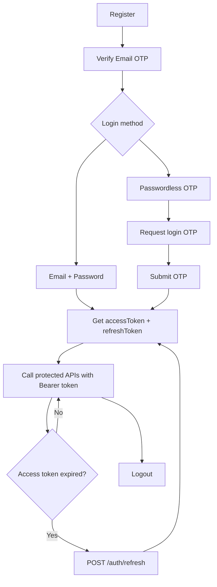

# Portvilla Frontend Auth — Implementation Guide

Step-by-step guide for integrating the Portvilla backend auth API into a frontend app (React/Vite assumed; patterns apply to any framework).

**Base URL:** `http://localhost:3000/api/v1`  
**Swagger:** `http://localhost:3000/docs`

---

## Table of Contents

1. [Overview, API Contract & Project Setup](#part-1--overview-api-contract--project-setup)
2. [Registration + Email Verification](#part-2--registration--email-verification)
3. [Password Login](#part-3--password-login)
4. [Passwordless OTP Login](#part-4--passwordless-otp-login)
5. [Token Storage, Refresh & Auth State](#part-5--token-storage-refresh--auth-state)
6. [Protected Routes, Logout & Interceptors](#part-6--protected-routes-logout--interceptors)
7. [Error Handling & UI States](#part-7--error-handling--ui-states)
8. [End-to-End Checklist](#part-8--end-to-end-checklist)

---

## Auth Flow Overview

Every user must **verify their email** before they can log in (password or OTP).



---

## Part 1 — Overview, API Contract & Project Setup

### Endpoints Reference

| Step | Method | Endpoint | Auth Required | Returns |
|------|--------|----------|---------------|---------|
| Register | `POST` | `/auth/register` | No | `{ message }` |
| Verify email | `POST` | `/auth/verify-email` | No | `{ message }` |
| Resend verification OTP | `POST` | `/auth/resend-otp` | No | `{ message }` |
| Login (password) | `POST` | `/auth/login` | No | `{ accessToken, refreshToken }` |
| Request login OTP | `POST` | `/auth/login/otp/request` | No | `{ message }` |
| Login (OTP) | `POST` | `/auth/login/otp` | No | `{ accessToken, refreshToken }` |
| Refresh tokens | `POST` | `/auth/refresh` | No | `{ accessToken, refreshToken }` |
| Logout | `POST` | `/auth/logout` | **Yes** (Bearer) | `{ message }` |

### Token & OTP Lifetimes

| Setting | Value |
|---------|-------|
| Access token expiry | 15 minutes (900 seconds) |
| Refresh token expiry | 7 days (604800 seconds) |
| OTP expiry | 15 minutes |

### JWT Payload (decode for UI only — never trust for security)

```typescript
interface JwtPayload {
  sub: string;    // user id
  email: string;
  role: 'user' | 'admin';
}
```

### Password Validation Rules

Match these on the frontend **before** submit (same rules as backend):

- 8–64 characters
- At least 1 uppercase letter
- At least 1 lowercase letter
- At least 1 digit
- At least 1 special character

Regex used by backend:

```typescript
/^(?=.*[a-z])(?=.*[A-Z])(?=.*\d)(?=.*[\W_]).+$/
```

### Step 1 — Shared TypeScript Types

Create `src/types/auth.ts`:

```typescript
export interface MessageResponse {
  message: string;
}

export interface TokenResponse {
  accessToken: string;
  refreshToken: string;
}

export interface RegisterPayload {
  email: string;
  password: string;
}

export interface LoginPayload {
  email: string;
  password: string;
}

export interface VerifyOtpPayload {
  email: string;
  otp: string;
}

export interface SendOtpPayload {
  email: string;
}

export interface RefreshTokenPayload {
  refreshToken: string;
}

export interface JwtPayload {
  sub: string;
  email: string;
  role: 'user' | 'admin';
}
```

### Step 2 — Environment Config

Create `.env.local` (Vite) or equivalent:

```env
VITE_API_BASE_URL=http://localhost:3000/api/v1
```

### Step 3 — Base API Client

Create `src/lib/api-client.ts`:

```typescript
const BASE_URL = import.meta.env.VITE_API_BASE_URL ?? 'http://localhost:3000/api/v1';

export class ApiError extends Error {
  constructor(
    public status: number,
    message: string,
    public body?: unknown,
  ) {
    super(message);
    this.name = 'ApiError';
  }
}

type RequestOptions = Omit<RequestInit, 'body'> & {
  body?: unknown;
  token?: string | null;
};

export async function apiClient<T>(
  path: string,
  options: RequestOptions = {},
): Promise<T> {
  const { body, token, headers, ...rest } = options;

  const response = await fetch(`${BASE_URL}${path}`, {
    ...rest,
    headers: {
      'Content-Type': 'application/json',
      ...(token ? { Authorization: `Bearer ${token}` } : {}),
      ...headers,
    },
    body: body !== undefined ? JSON.stringify(body) : undefined,
  });

  const data = await response.json().catch(() => null);

  if (!response.ok) {
    const message =
      (data as { message?: string | string[] })?.message ??
      response.statusText;

    throw new ApiError(
      response.status,
      Array.isArray(message) ? message.join(', ') : String(message),
      data,
    );
  }

  return data as T;
}
```

### HTTP Status Codes

| Status | Meaning | Frontend action |
|--------|---------|-----------------|
| `400` | Validation failed | Show field errors (`message` may be a string array) |
| `401` | Invalid credentials / expired token | Redirect to login |
| `403` | Email not verified | Redirect to verify-email page |
| `404` | Email not found | Show "No account found for this email" |
| `409` | Email exists / already verified | Show conflict message |
| `422` | Invalid or expired OTP | Show "Code expired or incorrect" |

### Part 1 Checklist

- [ ] `src/types/auth.ts` created
- [ ] `.env.local` with `VITE_API_BASE_URL`
- [ ] `src/lib/api-client.ts` created

---

## Part 2 — Registration + Email Verification

### User Journey

1. User fills register form → `POST /auth/register`
2. Redirect to verify-email page (pass `email` via route state or query param)
3. User enters 6-digit OTP → `POST /auth/verify-email`
4. On success → redirect to login page
5. Optional: resend OTP → `POST /auth/resend-otp`

### Auth API Service

Create `src/services/auth.service.ts`:

```typescript
import { apiClient } from '../lib/api-client';
import type {
  MessageResponse,
  RegisterPayload,
  SendOtpPayload,
  TokenResponse,
  VerifyOtpPayload,
  LoginPayload,
  RefreshTokenPayload,
} from '../types/auth';

export const authService = {
  register(payload: RegisterPayload) {
    return apiClient<MessageResponse>('/auth/register', {
      method: 'POST',
      body: payload,
    });
  },

  verifyEmail(payload: VerifyOtpPayload) {
    return apiClient<MessageResponse>('/auth/verify-email', {
      method: 'POST',
      body: payload,
    });
  },

  resendOtp(payload: SendOtpPayload) {
    return apiClient<MessageResponse>('/auth/resend-otp', {
      method: 'POST',
      body: payload,
    });
  },

  login(payload: LoginPayload) {
    return apiClient<TokenResponse>('/auth/login', {
      method: 'POST',
      body: payload,
    });
  },

  requestLoginOtp(payload: SendOtpPayload) {
    return apiClient<MessageResponse>('/auth/login/otp/request', {
      method: 'POST',
      body: payload,
    });
  },

  loginWithOtp(payload: VerifyOtpPayload) {
    return apiClient<TokenResponse>('/auth/login/otp', {
      method: 'POST',
      body: payload,
    });
  },

  refresh(payload: RefreshTokenPayload) {
    return apiClient<TokenResponse>('/auth/refresh', {
      method: 'POST',
      body: payload,
    });
  },

  logout(accessToken: string) {
    return apiClient<MessageResponse>('/auth/logout', {
      method: 'POST',
      token: accessToken,
    });
  },
};
```

### Password Validation Helper

Create `src/lib/password-validation.ts`:

```typescript
export interface PasswordValidationResult {
  valid: boolean;
  errors: string[];
}

export function validatePassword(password: string): PasswordValidationResult {
  const errors: string[] = [];

  if (password.length < 8) errors.push('At least 8 characters required.');
  if (password.length > 64) errors.push('Maximum 64 characters allowed.');
  if (!/[a-z]/.test(password)) errors.push('Include a lowercase letter.');
  if (!/[A-Z]/.test(password)) errors.push('Include an uppercase letter.');
  if (!/\d/.test(password)) errors.push('Include a digit.');
  if (!/[\W_]/.test(password)) errors.push('Include a special character.');

  return { valid: errors.length === 0, errors };
}
```

### Register Page (example)

```tsx
// src/pages/RegisterPage.tsx
import { useState } from 'react';
import { useNavigate } from 'react-router-dom';
import { authService } from '../services/auth.service';
import { validatePassword } from '../lib/password-validation';
import { ApiError } from '../lib/api-client';

export function RegisterPage() {
  const navigate = useNavigate();
  const [email, setEmail] = useState('');
  const [password, setPassword] = useState('');
  const [error, setError] = useState('');
  const [loading, setLoading] = useState(false);

  async function handleSubmit(e: React.FormEvent) {
    e.preventDefault();
    setError('');

    const { valid, errors } = validatePassword(password);
    if (!valid) {
      setError(errors.join(' '));
      return;
    }

    setLoading(true);
    try {
      await authService.register({ email, password });
      navigate('/verify-email', { state: { email } });
    } catch (err) {
      setError(err instanceof ApiError ? err.message : 'Registration failed.');
    } finally {
      setLoading(false);
    }
  }

  return (
    <form onSubmit={handleSubmit}>
      <input type="email" value={email} onChange={(e) => setEmail(e.target.value)} required />
      <input type="password" value={password} onChange={(e) => setPassword(e.target.value)} required />
      {error && <p role="alert">{error}</p>}
      <button type="submit" disabled={loading}>
        {loading ? 'Creating account…' : 'Register'}
      </button>
    </form>
  );
}
```

### Verify Email Page (example)

```tsx
// src/pages/VerifyEmailPage.tsx
import { useState } from 'react';
import { useLocation, useNavigate } from 'react-router-dom';
import { authService } from '../services/auth.service';
import { ApiError } from '../lib/api-client';

export function VerifyEmailPage() {
  const navigate = useNavigate();
  const location = useLocation();
  const email = (location.state as { email?: string })?.email ?? '';
  const [otp, setOtp] = useState('');
  const [error, setError] = useState('');
  const [message, setMessage] = useState('');
  const [loading, setLoading] = useState(false);
  const [resendCooldown, setResendCooldown] = useState(0);

  async function handleVerify(e: React.FormEvent) {
    e.preventDefault();
    setError('');
    setLoading(true);
    try {
      await authService.verifyEmail({ email, otp });
      navigate('/login', { state: { message: 'Email verified. You can now log in.' } });
    } catch (err) {
      setError(err instanceof ApiError ? err.message : 'Verification failed.');
    } finally {
      setLoading(false);
    }
  }

  async function handleResend() {
    if (resendCooldown > 0) return;
    setError('');
    try {
      await authService.resendOtp({ email });
      setMessage('A new code has been sent to your email.');
      setResendCooldown(60); // client-side cooldown; backend may also rate-limit
    } catch (err) {
      setError(err instanceof ApiError ? err.message : 'Could not resend code.');
    }
  }

  return (
    <form onSubmit={handleVerify}>
      <p>Enter the 6-digit code sent to {email}</p>
      <input
        inputMode="numeric"
        pattern="\d{6}"
        maxLength={6}
        value={otp}
        onChange={(e) => setOtp(e.target.value.replace(/\D/g, ''))}
        required
      />
      {message && <p>{message}</p>}
      {error && <p role="alert">{error}</p>}
      <button type="submit" disabled={loading || otp.length !== 6}>
        Verify
      </button>
      <button type="button" onClick={handleResend} disabled={resendCooldown > 0}>
        {resendCooldown > 0 ? `Resend in ${resendCooldown}s` : 'Resend code'}
      </button>
    </form>
  );
}
```

### Routes to Add

```tsx
{ path: '/register', element: <RegisterPage /> },
{ path: '/verify-email', element: <VerifyEmailPage /> },
```

### Part 2 Checklist

- [ ] `authService.register`, `verifyEmail`, `resendOtp` wired up
- [ ] Register form validates password client-side
- [ ] Verify page receives `email` from navigation state
- [ ] OTP input restricted to 6 digits
- [ ] Resend button with cooldown UI
- [ ] `409` on resend handled (already verified → redirect to login)

---

## Part 3 — Password Login

### User Journey

1. User enters email + password → `POST /auth/login`
2. Store `accessToken` + `refreshToken`
3. Redirect to dashboard / home

### Login Page (example)

```tsx
// src/pages/LoginPage.tsx
import { useState } from 'react';
import { useLocation, useNavigate } from 'react-router-dom';
import { authService } from '../services/auth.service';
import { useAuth } from '../context/AuthContext';
import { ApiError } from '../lib/api-client';

export function LoginPage() {
  const navigate = useNavigate();
  const location = useLocation();
  const { setTokens } = useAuth();
  const [email, setEmail] = useState('');
  const [password, setPassword] = useState('');
  const [error, setError] = useState('');
  const [loading, setLoading] = useState(false);

  const successMessage = (location.state as { message?: string })?.message;

  async function handleSubmit(e: React.FormEvent) {
    e.preventDefault();
    setError('');
    setLoading(true);
    try {
      const tokens = await authService.login({ email, password });
      setTokens(tokens);
      navigate('/', { replace: true });
    } catch (err) {
      if (err instanceof ApiError) {
        if (err.status === 403) {
          navigate('/verify-email', { state: { email } });
          return;
        }
        setError(err.message);
      } else {
        setError('Login failed.');
      }
    } finally {
      setLoading(false);
    }
  }

  return (
    <form onSubmit={handleSubmit}>
      {successMessage && <p>{successMessage}</p>}
      <input type="email" value={email} onChange={(e) => setEmail(e.target.value)} required />
      <input type="password" value={password} onChange={(e) => setPassword(e.target.value)} required />
      {error && <p role="alert">{error}</p>}
      <button type="submit" disabled={loading}>Log in</button>
      <a href="/login/otp">Log in with email code instead</a>
    </form>
  );
}
```

### Important: 403 Handling

If login returns **403 Forbidden**, the email is not verified. Redirect to `/verify-email` with the email pre-filled — do not show a generic error.

### Part 3 Checklist

- [ ] Login page calls `authService.login`
- [ ] Tokens stored via auth context (see Part 5)
- [ ] 403 redirects to verify-email
- [ ] 401 shows "Invalid email or password"
- [ ] Link to OTP login flow

---

## Part 4 — Passwordless OTP Login

Two-step flow mirroring email verification, but returns tokens on step 2.

### User Journey

1. User enters email → `POST /auth/login/otp/request`
2. User enters 6-digit OTP → `POST /auth/login/otp`
3. Store tokens → redirect to home

### Request OTP Page

```tsx
// src/pages/LoginOtpRequestPage.tsx
import { useState } from 'react';
import { useNavigate } from 'react-router-dom';
import { authService } from '../services/auth.service';
import { ApiError } from '../lib/api-client';

export function LoginOtpRequestPage() {
  const navigate = useNavigate();
  const [email, setEmail] = useState('');
  const [error, setError] = useState('');
  const [loading, setLoading] = useState(false);

  async function handleSubmit(e: React.FormEvent) {
    e.preventDefault();
    setError('');
    setLoading(true);
    try {
      await authService.requestLoginOtp({ email });
      navigate('/login/otp/verify', { state: { email } });
    } catch (err) {
      if (err instanceof ApiError && err.status === 403) {
        navigate('/verify-email', { state: { email } });
        return;
      }
      setError(err instanceof ApiError ? err.message : 'Could not send code.');
    } finally {
      setLoading(false);
    }
  }

  return (
    <form onSubmit={handleSubmit}>
      <input type="email" value={email} onChange={(e) => setEmail(e.target.value)} required />
      {error && <p role="alert">{error}</p>}
      <button type="submit" disabled={loading}>Send login code</button>
    </form>
  );
}
```

### Verify OTP & Login Page

```tsx
// src/pages/LoginOtpVerifyPage.tsx
import { useState } from 'react';
import { useLocation, useNavigate } from 'react-router-dom';
import { authService } from '../services/auth.service';
import { useAuth } from '../context/AuthContext';
import { ApiError } from '../lib/api-client';

export function LoginOtpVerifyPage() {
  const navigate = useNavigate();
  const location = useLocation();
  const email = (location.state as { email?: string })?.email ?? '';
  const { setTokens } = useAuth();
  const [otp, setOtp] = useState('');
  const [error, setError] = useState('');
  const [loading, setLoading] = useState(false);

  async function handleSubmit(e: React.FormEvent) {
    e.preventDefault();
    setError('');
    setLoading(true);
    try {
      const tokens = await authService.loginWithOtp({ email, otp });
      setTokens(tokens);
      navigate('/', { replace: true });
    } catch (err) {
      setError(err instanceof ApiError ? err.message : 'Invalid code.');
    } finally {
      setLoading(false);
    }
  }

  return (
    <form onSubmit={handleSubmit}>
      <p>Enter the login code sent to {email}</p>
      <input
        inputMode="numeric"
        maxLength={6}
        value={otp}
        onChange={(e) => setOtp(e.target.value.replace(/\D/g, ''))}
        required
      />
      {error && <p role="alert">{error}</p>}
      <button type="submit" disabled={loading || otp.length !== 6}>Log in</button>
    </form>
  );
}
```

### Routes to Add

```tsx
{ path: '/login', element: <LoginPage /> },
{ path: '/login/otp', element: <LoginOtpRequestPage /> },
{ path: '/login/otp/verify', element: <LoginOtpVerifyPage /> },
```

### Part 4 Checklist

- [ ] Two-step OTP login pages created
- [ ] Email passed between steps via route state
- [ ] 403 on request redirects to verify-email
- [ ] 422 shows OTP expired/invalid message
- [ ] Tokens stored on successful OTP login

---

## Part 5 — Token Storage, Refresh & Auth State

### Storage Strategy

| Token | Storage | Why |
|-------|---------|-----|
| `accessToken` | Memory (React state / context) | Short-lived; avoids XSS reading from localStorage |
| `refreshToken` | `httpOnly` cookie (ideal) or `localStorage` (simpler) | Needed across page reloads |

> **Note:** This backend returns refresh tokens in the JSON body (not as httpOnly cookies). For MVP, store both in `localStorage`. For production, consider a BFF or cookie-based refresh.

### Token Storage Helper

```typescript
// src/lib/token-storage.ts
import type { TokenResponse } from '../types/auth';

const ACCESS_KEY = 'portvilla_access_token';
const REFRESH_KEY = 'portvilla_refresh_token';

export const tokenStorage = {
  getAccessToken(): string | null {
    return localStorage.getItem(ACCESS_KEY);
  },

  getRefreshToken(): string | null {
    return localStorage.getItem(REFRESH_KEY);
  },

  setTokens({ accessToken, refreshToken }: TokenResponse) {
    localStorage.setItem(ACCESS_KEY, accessToken);
    localStorage.setItem(REFRESH_KEY, refreshToken);
  },

  clear() {
    localStorage.removeItem(ACCESS_KEY);
    localStorage.removeItem(REFRESH_KEY);
  },
};
```

### JWT Decode Helper (UI only)

```typescript
// src/lib/jwt-decode.ts
import type { JwtPayload } from '../types/auth';

export function decodeJwt(token: string): JwtPayload | null {
  try {
    const payload = token.split('.')[1];
    return JSON.parse(atob(payload.replace(/-/g, '+').replace(/_/g, '/')));
  } catch {
    return null;
  }
}
```

### Auth Context

```tsx
// src/context/AuthContext.tsx
import { createContext, useContext, useMemo, useState, useCallback } from 'react';
import type { TokenResponse } from '../types/auth';
import { tokenStorage } from '../lib/token-storage';
import { decodeJwt } from '../lib/jwt-decode';

interface AuthContextValue {
  accessToken: string | null;
  isAuthenticated: boolean;
  user: { id: string; email: string; role: string } | null;
  setTokens: (tokens: TokenResponse) => void;
  clearAuth: () => void;
}

const AuthContext = createContext<AuthContextValue | null>(null);

export function AuthProvider({ children }: { children: React.ReactNode }) {
  const [accessToken, setAccessToken] = useState<string | null>(
    () => tokenStorage.getAccessToken(),
  );

  const setTokens = useCallback((tokens: TokenResponse) => {
    tokenStorage.setTokens(tokens);
    setAccessToken(tokens.accessToken);
  }, []);

  const clearAuth = useCallback(() => {
    tokenStorage.clear();
    setAccessToken(null);
  }, []);

  const user = useMemo(() => {
    if (!accessToken) return null;
    const payload = decodeJwt(accessToken);
    if (!payload) return null;
    return { id: payload.sub, email: payload.email, role: payload.role };
  }, [accessToken]);

  const value = useMemo(
    () => ({
      accessToken,
      isAuthenticated: !!accessToken,
      user,
      setTokens,
      clearAuth,
    }),
    [accessToken, user, setTokens, clearAuth],
  );

  return <AuthContext.Provider value={value}>{children}</AuthContext.Provider>;
}

export function useAuth() {
  const ctx = useContext(AuthContext);
  if (!ctx) throw new Error('useAuth must be used within AuthProvider');
  return ctx;
}
```

### Token Refresh Logic

The backend **rotates** refresh tokens — each call to `/auth/refresh` invalidates the old refresh token and returns a new pair.

```typescript
// src/lib/refresh-tokens.ts
import { authService } from '../services/auth.service';
import { tokenStorage } from './token-storage';

let refreshPromise: Promise<string | null> | null = null;

export async function refreshAccessToken(): Promise<string | null> {
  if (refreshPromise) return refreshPromise;

  refreshPromise = (async () => {
    const refreshToken = tokenStorage.getRefreshToken();
    if (!refreshToken) return null;

    try {
      const tokens = await authService.refresh({ refreshToken });
      tokenStorage.setTokens(tokens);
      return tokens.accessToken;
    } catch {
      tokenStorage.clear();
      return null;
    } finally {
      refreshPromise = null;
    }
  })();

  return refreshPromise;
}
```

> Use a **singleton promise** to prevent multiple simultaneous refresh calls when several API requests fail with 401 at once.

### Part 5 Checklist

- [ ] `tokenStorage` helper created
- [ ] `AuthProvider` wraps the app
- [ ] Tokens persisted on login
- [ ] JWT decoded for user display (email, role)
- [ ] Refresh logic with deduplication

---

## Part 6 — Protected Routes, Logout & Interceptors

### Protected Route Component

```tsx
// src/components/ProtectedRoute.tsx
import { Navigate } from 'react-router-dom';
import { useAuth } from '../context/AuthContext';

export function ProtectedRoute({ children }: { children: React.ReactNode }) {
  const { isAuthenticated } = useAuth();

  if (!isAuthenticated) {
    return <Navigate to="/login" replace />;
  }

  return <>{children}</>;
}
```

Usage:

```tsx
{
  path: '/dashboard',
  element: (
    <ProtectedRoute>
      <DashboardPage />
    </ProtectedRoute>
  ),
}
```

### Authenticated API Client (with auto-refresh)

```typescript
// src/lib/authenticated-api-client.ts
import { apiClient, ApiError } from './api-client';
import { tokenStorage } from './token-storage';
import { refreshAccessToken } from './refresh-tokens';

export async function authenticatedApiClient<T>(
  path: string,
  options: Parameters<typeof apiClient>[1] = {},
): Promise<T> {
  const accessToken = tokenStorage.getAccessToken();

  try {
    return await apiClient<T>(path, { ...options, token: accessToken });
  } catch (err) {
    if (err instanceof ApiError && err.status === 401) {
      const newToken = await refreshAccessToken();
      if (!newToken) throw err;
      return apiClient<T>(path, { ...options, token: newToken });
    }
    throw err;
  }
}
```

### Logout

```typescript
async function logout() {
  const accessToken = tokenStorage.getAccessToken();
  try {
    if (accessToken) {
      await authService.logout(accessToken);
    }
  } finally {
    clearAuth(); // from useAuth()
    navigate('/login');
  }
}
```

> Always clear tokens locally even if the logout API call fails (network error, expired token).

### App Bootstrap — Refresh on Load

On app startup, if a refresh token exists but the access token is expired, silently refresh:

```tsx
// src/App.tsx (inside AuthProvider)
useEffect(() => {
  const refreshToken = tokenStorage.getRefreshToken();
  if (refreshToken) {
    refreshAccessToken().then((token) => {
      if (token) setAccessToken(token);
      else clearAuth();
    });
  }
}, []);
```

### Part 6 Checklist

- [ ] `ProtectedRoute` guards private pages
- [ ] `authenticatedApiClient` attaches Bearer token
- [ ] 401 triggers refresh, then retries once
- [ ] Logout calls API + clears local tokens
- [ ] App refreshes token on page reload

---

## Part 7 — Error Handling & UI States

### Recommended UX Patterns

| Scenario | UX |
|----------|-----|
| Register — email exists (409) | "An account with this email already exists. Log in instead?" |
| Verify — wrong OTP (422) | "Invalid code. Please try again." |
| Verify — expired OTP (422) | "Code expired. Request a new one." |
| Login — unverified (403) | Redirect to verify-email with message |
| Login — wrong password (401) | "Invalid email or password." |
| Refresh failed (401) | Clear tokens, redirect to login with "Session expired" |
| Logout | Clear state immediately, show brief confirmation |
| Network error | "Unable to connect. Check your connection." |

### Loading States

Every auth form should disable submit and show a spinner while the request is in flight. Prevent double-submit.

### OTP Input Best Practices

- Use `inputMode="numeric"` for mobile keyboards
- Strip non-digits on input
- Auto-focus first digit box (if using split inputs)
- Show countdown timer for 15-minute OTP expiry
- Resend cooldown: 60 seconds client-side (backend may also rate-limit with 429)

### Global Error Boundary

Wrap auth pages in an error boundary so unexpected crashes don't leave the user stuck.

### Part 7 Checklist

- [ ] All HTTP status codes mapped to user-friendly messages
- [ ] Loading/disabled states on all forms
- [ ] OTP resend cooldown implemented
- [ ] Session-expired toast on forced logout

---

## Part 8 — End-to-End Checklist

### File Structure

```
src/
├── types/
│   └── auth.ts
├── lib/
│   ├── api-client.ts
│   ├── authenticated-api-client.ts
│   ├── password-validation.ts
│   ├── token-storage.ts
│   ├── jwt-decode.ts
│   └── refresh-tokens.ts
├── services/
│   └── auth.service.ts
├── context/
│   └── AuthContext.tsx
├── components/
│   └── ProtectedRoute.tsx
└── pages/
    ├── RegisterPage.tsx
    ├── VerifyEmailPage.tsx
    ├── LoginPage.tsx
    ├── LoginOtpRequestPage.tsx
    └── LoginOtpVerifyPage.tsx
```

### Route Map

| Route | Public | Purpose |
|-------|--------|---------|
| `/register` | Yes | Create account |
| `/verify-email` | Yes | Confirm email OTP |
| `/login` | Yes | Password login |
| `/login/otp` | Yes | Request login OTP |
| `/login/otp/verify` | Yes | Submit login OTP |
| `/` or `/dashboard` | No | Protected home |

### Manual Test Plan

1. **Register** with valid email/password → check email for OTP
2. **Verify** with correct OTP → success message
3. **Verify** with wrong OTP → 422 error shown
4. **Resend OTP** → new code received
5. **Login** before verify → 403, redirected to verify page
6. **Login** with password → tokens stored, redirected home
7. **Access protected page** → loads with Bearer token
8. **Wait 15+ min** (or shorten JWT expiry in dev) → auto-refresh works
9. **Logout** → tokens cleared, protected page redirects to login
10. **OTP login** → request code, submit, receive tokens
11. **Refresh token reuse** → second refresh with old token fails (401)

### Security Reminders

- Never log tokens to console in production
- Do not store tokens in URL query params
- Clear tokens on logout even if API fails
- Validate passwords client-side for UX, but backend always re-validates
- Decode JWT for display only — authorization decisions belong on the backend

---

## Quick Reference — All Request Bodies

```typescript
// Register
POST /auth/register
{ email: string, password: string }

// Verify email
POST /auth/verify-email
{ email: string, otp: string }

// Resend verification OTP
POST /auth/resend-otp
{ email: string }

// Login
POST /auth/login
{ email: string, password: string }

// Request login OTP
POST /auth/login/otp/request
{ email: string }

// Login with OTP
POST /auth/login/otp
{ email: string, otp: string }

// Refresh
POST /auth/refresh
{ refreshToken: string }

// Logout (requires Authorization: Bearer <accessToken>)
POST /auth/logout
(no body)
```
